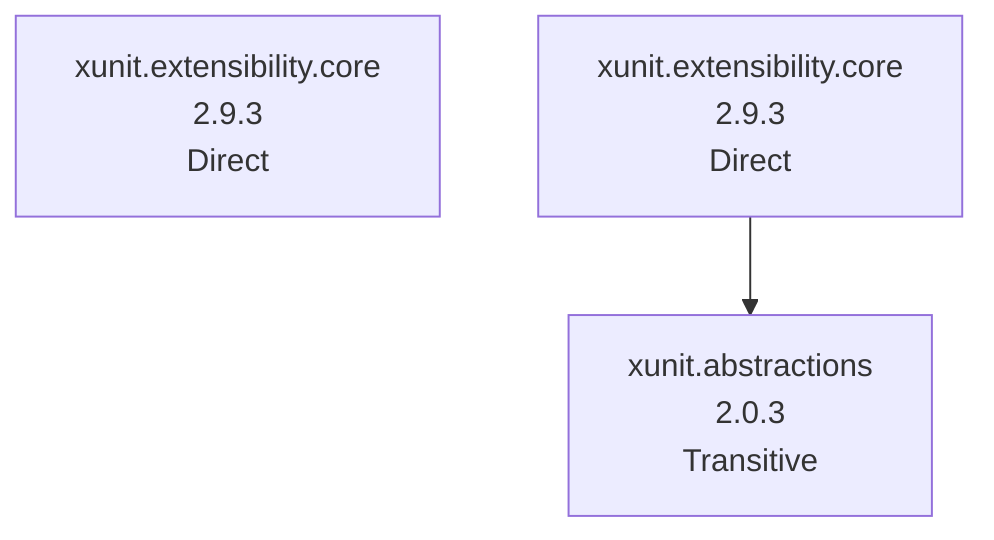

# NuGet Audit Report - RolandConverter

- Snapshot ID: `20260405130131_564e1c10`
- Captured UTC: `2026-04-05T13:01:31.0687163+00:00`
- Solution: `C:\Users\windo\OneDrive\Documents\Development\RolandConverter\RolandConverter.sln`
- Source identity key: `949A9D1C44EB58A2`
- Source identity kind: `disk-path`
- Source machine: `SURFACELAPTOP7`
- Repository root: `C:\Users\windo\OneDrive\Documents\Development\RolandConverter`
- Git remote: `-`
- Analysis status: `Complete`
- Projects analysed: `2`
- Packages discovered: `24`
- Direct packages: `10`
- Transitive packages: `14`
- Dependency edges: `15`
- Error diagnostics: `0`
- Warning diagnostics: `20`
- Delta changed: `True`
- Knowledge snapshot generated: `2026-04-05T13:01:31.0687163+00:00`

## Attention Required

| Severity | Project | Package | Message | .NET version |
|---|---|---|---|---|
| Warning | RolandConverter | xunit.extensibility.core | Package 'xunit.extensibility.core' 2.9.3: latest compatible stable matches the resolved version, but that release was published more than a year ago on nuget.org. | net8.0-windows |
| Warning | RolandConverter | xunit.extensibility.core | Package 'xunit.extensibility.core' 2.9.3: latest compatible stable matches the resolved version, but that release was published more than a year ago on nuget.org. | net8.0-windows7.0 |
| Warning | RolandConverter.Tests | Microsoft.CodeCoverage | Package 'Microsoft.CodeCoverage' 17.14.0 is outdated. Latest compatible stable version: 18.3.0. | net8.0-windows7.0 |
| Warning | RolandConverter.Tests | Microsoft.NET.Test.Sdk | Package 'Microsoft.NET.Test.Sdk' 17.14.0 is outdated. Latest compatible stable version: 18.3.0. | net8.0-windows |
| Warning | RolandConverter.Tests | Microsoft.NET.Test.Sdk | Package 'Microsoft.NET.Test.Sdk' 17.14.0 is outdated. Latest compatible stable version: 18.3.0. | net8.0-windows7.0 |
| Warning | RolandConverter.Tests | Microsoft.TestPlatform.ObjectModel | Package 'Microsoft.TestPlatform.ObjectModel' 17.14.0 is outdated. Latest compatible stable version: 18.3.0. | net8.0-windows7.0 |
| Warning | RolandConverter.Tests | Microsoft.TestPlatform.TestHost | Package 'Microsoft.TestPlatform.TestHost' 17.14.0 is outdated. Latest compatible stable version: 18.3.0. | net8.0-windows7.0 |
| Warning | RolandConverter.Tests | Newtonsoft.Json | Package 'Newtonsoft.Json' 13.0.3 is outdated. Latest compatible stable version: 13.0.4. | net8.0-windows7.0 |
| Warning | RolandConverter.Tests | RolandConverter | Package 'RolandConverter' was not found on nuget.org (registration returned HTTP 404). Confirm the id, private feeds, or a replacement package. | net8.0-windows7.0 |
| Warning | RolandConverter.Tests | System.Collections.Immutable | Package 'System.Collections.Immutable' 8.0.0 is outdated. Latest compatible stable version: 10.0.5. | net8.0-windows7.0 |
| Warning | RolandConverter.Tests | System.Reflection.Metadata | Package 'System.Reflection.Metadata' 8.0.0 is outdated. Latest compatible stable version: 10.0.5. | net8.0-windows7.0 |
| Warning | RolandConverter.Tests | xunit | Package 'xunit' 2.9.3: latest compatible stable matches the resolved version, but that release was published more than a year ago on nuget.org. | net8.0-windows |
| Warning | RolandConverter.Tests | xunit | Package 'xunit' 2.9.3: latest compatible stable matches the resolved version, but that release was published more than a year ago on nuget.org. | net8.0-windows7.0 |
| Warning | RolandConverter.Tests | xunit.analyzers | Package 'xunit.analyzers' 1.18.0 is outdated. Latest compatible stable version: 1.27.0. | net8.0-windows7.0 |
| Warning | RolandConverter.Tests | xunit.assert | Package 'xunit.assert' 2.9.3: latest compatible stable matches the resolved version, but that release was published more than a year ago on nuget.org. | net8.0-windows7.0 |
| Warning | RolandConverter.Tests | xunit.core | Package 'xunit.core' 2.9.3: latest compatible stable matches the resolved version, but that release was published more than a year ago on nuget.org. | net8.0-windows7.0 |
| Warning | RolandConverter.Tests | xunit.extensibility.core | Package 'xunit.extensibility.core' 2.9.3: latest compatible stable matches the resolved version, but that release was published more than a year ago on nuget.org. | net8.0-windows7.0 |
| Warning | RolandConverter.Tests | xunit.extensibility.execution | Package 'xunit.extensibility.execution' 2.9.3: latest compatible stable matches the resolved version, but that release was published more than a year ago on nuget.org. | net8.0-windows7.0 |
| Warning | RolandConverter.Tests | xunit.runner.visualstudio | Package 'xunit.runner.visualstudio' 3.1.0 is outdated. Latest compatible stable version: 3.1.5. | net8.0-windows |
| Warning | RolandConverter.Tests | xunit.runner.visualstudio | Package 'xunit.runner.visualstudio' 3.1.0 is outdated. Latest compatible stable version: 3.1.5. | net8.0-windows7.0 |

## Change Summary

| Project | Package | Change | Previous | Current | .NET version |
|---|---|---|---|---|---|
| RolandConverter | xunit.abstractions | MetadataChanged | 2.0.3 | 2.0.3 | net8.0-windows7.0 |
| RolandConverter.Tests | coverlet.collector | MetadataChanged | 6.0.4 | 6.0.4 | net8.0-windows |
| RolandConverter.Tests | coverlet.collector | MetadataChanged | 6.0.4 | 6.0.4 | net8.0-windows7.0 |
| RolandConverter.Tests | xunit.abstractions | MetadataChanged | 2.0.3 | 2.0.3 | net8.0-windows7.0 |

## Knowledge Changes

| Package | Version | Determined UTC | Previous Health | Current Health | Risk | Alert | Remediation | Summary |
|---|---|---|---|---|---|---|---|---|
| coverlet.collector | 6.0.4 | 2026-04-05T13:01:31.0687163+00:00 | abandoned | ok | 28.10 (Medium) | 35.00 (Medium) | - | Development status is now Active. Remediation guidance changed. |
| xunit.abstractions | 2.0.3 | 2026-04-05T13:01:31.0687163+00:00 | abandoned | ok | 27.30 (Medium) | 34.20 (Medium) | - | Development status is now Active. Remediation guidance changed. |

## Security and Health Transitions

| Project | Package | Previous Health | Current Health | Previous Vulnerabilities | Current Vulnerabilities | .NET version |
|---|---|---|---|---|---|---|
| RolandConverter | xunit.abstractions | abandoned | ok | - | - | net8.0-windows7.0 |
| RolandConverter.Tests | coverlet.collector | abandoned | ok | - | - | net8.0-windows |
| RolandConverter.Tests | coverlet.collector | abandoned | ok | - | - | net8.0-windows7.0 |
| RolandConverter.Tests | xunit.abstractions | abandoned | ok | - | - | net8.0-windows7.0 |

## Dependency Relationship Changes

No dependency edge changes were detected relative to the previous accepted snapshot.

## Project Details

### RolandConverter

- Path: `C:\Users\windo\OneDrive\Documents\Development\RolandConverter\RolandConverter\RolandConverter.csproj`
- Style: `PackageReference`
- Load state: `Loaded`
- Analysis status: `Complete`
- .NET version: `net8.0-windows`
- Diagnostics:
  - [Warning] Package 'xunit.extensibility.core' 2.9.3: latest compatible stable matches the resolved version, but that release was published more than a year ago on nuget.org.
  - [Warning] Package 'xunit.extensibility.core' 2.9.3: latest compatible stable matches the resolved version, but that release was published more than a year ago on nuget.org.

| Package | Kind | Requested | Resolved | Health | Vulnerability Detail | Risk | Alert | Knowledge Determined | Status Changed | Remediation | Central | Parents | Path | .NET version |
|---|---|---|---|---|---|---|---|---|---|---|---|---|---|---|
| xunit.abstractions | Transitive | - | 2.0.3 | ok | - | 27.30 (Medium) | 34.20 (Medium) | 2026-04-05T13:01:31.0687163+00:00 | 2026-04-05T13:01:31.0687163+00:00 | - | No | xunit.extensibility.core | xunit.abstractions -> xunit.extensibility.core | net8.0-windows7.0 |
| xunit.extensibility.core | Direct | 2.9.3 | - | abandoned | - | 37.40 (Medium) | 46.40 (Medium) | 2026-04-05T13:01:31.0687163+00:00 | 2026-04-05T03:19:24.0138186+00:00 | Latest compatible stable release is more than a year old on nuget.org; evaluate maintenance and alternatives. | No | - | - | net8.0-windows |
| xunit.extensibility.core | Direct | - | 2.9.3 | abandoned | - | 37.40 (Medium) | 46.40 (Medium) | 2026-04-05T13:01:31.0687163+00:00 | 2026-04-05T03:19:24.0138186+00:00 | Latest compatible stable release is more than a year old on nuget.org; evaluate maintenance and alternatives. | No | - | xunit.extensibility.core | net8.0-windows7.0 |

#### Dependency Graph Table

| From Package | To Package | .NET version |
|---|---|---|
| xunit.extensibility.core | xunit.abstractions | net8.0-windows7.0 |

#### Dependency Graph Mermaid

### RolandConverter.Tests

- Path: `C:\Users\windo\OneDrive\Documents\Development\RolandConverter\RolandConverter.Tests\RolandConverter.Tests.csproj`
- Style: `PackageReference`
- Load state: `Loaded`
- Analysis status: `Complete`
- .NET version: `net8.0-windows`
- Diagnostics:
  - [Warning] Package 'Microsoft.CodeCoverage' 17.14.0 is outdated. Latest compatible stable version: 18.3.0.
  - [Warning] Package 'Microsoft.NET.Test.Sdk' 17.14.0 is outdated. Latest compatible stable version: 18.3.0.
  - [Warning] Package 'Microsoft.NET.Test.Sdk' 17.14.0 is outdated. Latest compatible stable version: 18.3.0.
  - [Warning] Package 'Microsoft.TestPlatform.ObjectModel' 17.14.0 is outdated. Latest compatible stable version: 18.3.0.
  - [Warning] Package 'Microsoft.TestPlatform.TestHost' 17.14.0 is outdated. Latest compatible stable version: 18.3.0.
  - [Warning] Package 'Newtonsoft.Json' 13.0.3 is outdated. Latest compatible stable version: 13.0.4.
  - [Warning] Package 'RolandConverter' was not found on nuget.org (registration returned HTTP 404). Confirm the id, private feeds, or a replacement package.
  - [Warning] Package 'System.Collections.Immutable' 8.0.0 is outdated. Latest compatible stable version: 10.0.5.
  - [Warning] Package 'System.Reflection.Metadata' 8.0.0 is outdated. Latest compatible stable version: 10.0.5.
  - [Warning] Package 'xunit' 2.9.3: latest compatible stable matches the resolved version, but that release was published more than a year ago on nuget.org.
  - [Warning] Package 'xunit' 2.9.3: latest compatible stable matches the resolved version, but that release was published more than a year ago on nuget.org.
  - [Warning] Package 'xunit.analyzers' 1.18.0 is outdated. Latest compatible stable version: 1.27.0.
  - [Warning] Package 'xunit.assert' 2.9.3: latest compatible stable matches the resolved version, but that release was published more than a year ago on nuget.org.
  - [Warning] Package 'xunit.core' 2.9.3: latest compatible stable matches the resolved version, but that release was published more than a year ago on nuget.org.
  - [Warning] Package 'xunit.extensibility.core' 2.9.3: latest compatible stable matches the resolved version, but that release was published more than a year ago on nuget.org.
  - [Warning] Package 'xunit.extensibility.execution' 2.9.3: latest compatible stable matches the resolved version, but that release was published more than a year ago on nuget.org.
  - [Warning] Package 'xunit.runner.visualstudio' 3.1.0 is outdated. Latest compatible stable version: 3.1.5.
  - [Warning] Package 'xunit.runner.visualstudio' 3.1.0 is outdated. Latest compatible stable version: 3.1.5.

| Package | Kind | Requested | Resolved | Health | Vulnerability Detail | Risk | Alert | Knowledge Determined | Status Changed | Remediation | Central | Parents | Path | .NET version |
|---|---|---|---|---|---|---|---|---|---|---|---|---|---|---|
| coverlet.collector | Direct | 6.0.4 | - | ok | - | 28.10 (Medium) | 35.00 (Medium) | 2026-04-05T13:01:31.0687163+00:00 | 2026-04-05T13:01:31.0687163+00:00 | - | No | - | - | net8.0-windows |
| coverlet.collector | Direct | - | 6.0.4 | ok | - | 28.10 (Medium) | 35.00 (Medium) | 2026-04-05T13:01:31.0687163+00:00 | 2026-04-05T13:01:31.0687163+00:00 | - | No | - | coverlet.collector | net8.0-windows7.0 |
| Microsoft.CodeCoverage | Transitive | - | 17.14.0 | outdated->18.3.0 | - | 29.10 (Medium) | 40.20 (Medium) | 2026-04-05T13:01:31.0687163+00:00 | 2026-04-05T03:19:24.0138186+00:00 | Upgrade to 18.3.0. | No | Microsoft.NET.Test.Sdk | Microsoft.CodeCoverage -> Microsoft.NET.Test.Sdk | net8.0-windows7.0 |
| Microsoft.NET.Test.Sdk | Direct | 17.14.0 | - | outdated->18.3.0 | - | 32.30 (Medium) | 43.40 (Medium) | 2026-04-05T13:01:31.0687163+00:00 | 2026-04-05T03:19:24.0138186+00:00 | Upgrade to 18.3.0. | No | - | - | net8.0-windows |
| Microsoft.NET.Test.Sdk | Direct | - | 17.14.0 | outdated->18.3.0 | - | 32.30 (Medium) | 43.40 (Medium) | 2026-04-05T13:01:31.0687163+00:00 | 2026-04-05T03:19:24.0138186+00:00 | Upgrade to 18.3.0. | No | - | Microsoft.NET.Test.Sdk | net8.0-windows7.0 |
| Microsoft.TestPlatform.ObjectModel | Transitive | - | 17.14.0 | outdated->18.3.0 | - | 29.10 (Medium) | 40.20 (Medium) | 2026-04-05T13:01:31.0687163+00:00 | 2026-04-05T03:19:24.0138186+00:00 | Upgrade to 18.3.0. | No | Microsoft.TestPlatform.TestHost | Microsoft.TestPlatform.ObjectModel -> Microsoft.TestPlatform.TestHost -> Microsoft.NET.Test.Sdk | net8.0-windows7.0 |
| Microsoft.TestPlatform.TestHost | Transitive | - | 17.14.0 | outdated->18.3.0 | - | 29.10 (Medium) | 40.20 (Medium) | 2026-04-05T13:01:31.0687163+00:00 | 2026-04-05T03:19:24.0138186+00:00 | Upgrade to 18.3.0. | No | Microsoft.NET.Test.Sdk | Microsoft.TestPlatform.TestHost -> Microsoft.NET.Test.Sdk | net8.0-windows7.0 |
| Newtonsoft.Json | Transitive | - | 13.0.3 | outdated->13.0.4 | - | 29.10 (Medium) | 40.20 (Medium) | 2026-04-05T13:01:31.0687163+00:00 | 2026-04-05T03:19:24.0138186+00:00 | Upgrade to 13.0.4. | No | Microsoft.TestPlatform.TestHost | Newtonsoft.Json -> Microsoft.TestPlatform.TestHost -> Microsoft.NET.Test.Sdk | net8.0-windows7.0 |
| RolandConverter | Transitive | - | 1.0.0 | removed | - | 34.20 (Medium) | 43.20 (Medium) | 2026-04-05T13:01:31.0687163+00:00 | 2026-04-05T03:19:24.0138186+00:00 | Package id was not found on nuget.org; confirm private feeds or a replacement package. | No | - | RolandConverter | net8.0-windows7.0 |
| System.Collections.Immutable | Transitive | - | 8.0.0 | outdated->10.0.5 | - | 29.10 (Medium) | 40.20 (Medium) | 2026-04-05T13:01:31.0687163+00:00 | 2026-04-05T03:19:24.0138186+00:00 | Upgrade to 10.0.5. | No | System.Reflection.Metadata | System.Collections.Immutable -> System.Reflection.Metadata -> Microsoft.TestPlatform.ObjectModel -> Microsoft.TestPlatform.TestHost -> Microsoft.NET.Test.Sdk | net8.0-windows7.0 |
| System.Reflection.Metadata | Transitive | - | 8.0.0 | outdated->10.0.5 | - | 29.10 (Medium) | 40.20 (Medium) | 2026-04-05T13:01:31.0687163+00:00 | 2026-04-05T03:19:24.0138186+00:00 | Upgrade to 10.0.5. | No | Microsoft.TestPlatform.ObjectModel | System.Reflection.Metadata -> Microsoft.TestPlatform.ObjectModel -> Microsoft.TestPlatform.TestHost -> Microsoft.NET.Test.Sdk | net8.0-windows7.0 |
| xunit | Direct | 2.9.3 | - | abandoned | - | 35.00 (Medium) | 44.00 (Medium) | 2026-04-05T13:01:31.0687163+00:00 | 2026-04-05T03:19:24.0138186+00:00 | Latest compatible stable release is more than a year old on nuget.org; evaluate maintenance and alternatives. | No | - | - | net8.0-windows |
| xunit | Direct | - | 2.9.3 | abandoned | - | 35.00 (Medium) | 44.00 (Medium) | 2026-04-05T13:01:31.0687163+00:00 | 2026-04-05T03:19:24.0138186+00:00 | Latest compatible stable release is more than a year old on nuget.org; evaluate maintenance and alternatives. | No | - | xunit | net8.0-windows7.0 |
| xunit.abstractions | Transitive | - | 2.0.3 | ok | - | 27.30 (Medium) | 34.20 (Medium) | 2026-04-05T13:01:31.0687163+00:00 | 2026-04-05T13:01:31.0687163+00:00 | - | No | xunit.extensibility.core | xunit.abstractions -> xunit.extensibility.core -> xunit.core -> xunit | net8.0-windows7.0 |
| xunit.analyzers | Transitive | - | 1.18.0 | outdated->1.27.0 | - | 29.10 (Medium) | 40.20 (Medium) | 2026-04-05T13:01:31.0687163+00:00 | 2026-04-05T03:19:24.0138186+00:00 | Upgrade to 1.27.0. | No | xunit | xunit.analyzers -> xunit | net8.0-windows7.0 |
| xunit.assert | Transitive | - | 2.9.3 | abandoned | - | 31.80 (Medium) | 40.80 (Medium) | 2026-04-05T13:01:31.0687163+00:00 | 2026-04-05T03:19:24.0138186+00:00 | Latest compatible stable release is more than a year old on nuget.org; evaluate maintenance and alternatives. | No | xunit | xunit.assert -> xunit | net8.0-windows7.0 |
| xunit.core | Transitive | - | 2.9.3 | abandoned | - | 31.80 (Medium) | 40.80 (Medium) | 2026-04-05T13:01:31.0687163+00:00 | 2026-04-05T03:19:24.0138186+00:00 | Latest compatible stable release is more than a year old on nuget.org; evaluate maintenance and alternatives. | No | xunit | xunit.core -> xunit | net8.0-windows7.0 |
| xunit.extensibility.core | Transitive | - | 2.9.3 | abandoned | - | 37.40 (Medium) | 46.40 (Medium) | 2026-04-05T13:01:31.0687163+00:00 | 2026-04-05T03:19:24.0138186+00:00 | Latest compatible stable release is more than a year old on nuget.org; evaluate maintenance and alternatives. | No | RolandConverter, xunit.core, xunit.extensibility.execution | xunit.extensibility.core -> RolandConverter | net8.0-windows7.0 |
| xunit.extensibility.execution | Transitive | - | 2.9.3 | abandoned | - | 31.80 (Medium) | 40.80 (Medium) | 2026-04-05T13:01:31.0687163+00:00 | 2026-04-05T03:19:24.0138186+00:00 | Latest compatible stable release is more than a year old on nuget.org; evaluate maintenance and alternatives. | No | xunit.core | xunit.extensibility.execution -> xunit.core -> xunit | net8.0-windows7.0 |
| xunit.runner.visualstudio | Direct | 3.1.0 | - | outdated->3.1.5 | - | 32.30 (Medium) | 43.40 (Medium) | 2026-04-05T13:01:31.0687163+00:00 | 2026-04-05T03:19:24.0138186+00:00 | Upgrade to 3.1.5. | No | - | - | net8.0-windows |
| xunit.runner.visualstudio | Direct | - | 3.1.0 | outdated->3.1.5 | - | 32.30 (Medium) | 43.40 (Medium) | 2026-04-05T13:01:31.0687163+00:00 | 2026-04-05T03:19:24.0138186+00:00 | Upgrade to 3.1.5. | No | - | xunit.runner.visualstudio | net8.0-windows7.0 |

#### Dependency Graph Table

| From Package | To Package | .NET version |
|---|---|---|
| Microsoft.NET.Test.Sdk | Microsoft.CodeCoverage | net8.0-windows7.0 |
| Microsoft.NET.Test.Sdk | Microsoft.TestPlatform.TestHost | net8.0-windows7.0 |
| Microsoft.TestPlatform.ObjectModel | System.Reflection.Metadata | net8.0-windows7.0 |
| Microsoft.TestPlatform.TestHost | Microsoft.TestPlatform.ObjectModel | net8.0-windows7.0 |
| Microsoft.TestPlatform.TestHost | Newtonsoft.Json | net8.0-windows7.0 |
| RolandConverter | xunit.extensibility.core | net8.0-windows7.0 |
| System.Reflection.Metadata | System.Collections.Immutable | net8.0-windows7.0 |
| xunit | xunit.analyzers | net8.0-windows7.0 |
| xunit | xunit.assert | net8.0-windows7.0 |
| xunit | xunit.core | net8.0-windows7.0 |
| xunit.core | xunit.extensibility.core | net8.0-windows7.0 |
| xunit.core | xunit.extensibility.execution | net8.0-windows7.0 |
| xunit.extensibility.core | xunit.abstractions | net8.0-windows7.0 |
| xunit.extensibility.execution | xunit.extensibility.core | net8.0-windows7.0 |

#### Dependency Graph Mermaid

```mermaid
graph TD
    NC__USERS_WINDO_ONEDRIVE_DOCUMENTS_DEVELOPMENT_ROLANDCONVERTER_ROLANDCONVERTER_SLN_C__USERS_WINDO_ONEDRIVE_DOCUMENTS_DEVELOPMENT_ROLANDCONVERTER_ROLANDCONVERTER_TESTS_ROLANDCONVERTER_TESTS_CSPROJ_NET8_0_WINDOWS_NONE_COVERLET_COLLECTOR["coverlet.collector\n6.0.4\nDirect"]
    NC__USERS_WINDO_ONEDRIVE_DOCUMENTS_DEVELOPMENT_ROLANDCONVERTER_ROLANDCONVERTER_SLN_C__USERS_WINDO_ONEDRIVE_DOCUMENTS_DEVELOPMENT_ROLANDCONVERTER_ROLANDCONVERTER_TESTS_ROLANDCONVERTER_TESTS_CSPROJ_NET8_0_WINDOWS7_0_NONE_COVERLET_COLLECTOR["coverlet.collector\n6.0.4\nDirect"]
    NC__USERS_WINDO_ONEDRIVE_DOCUMENTS_DEVELOPMENT_ROLANDCONVERTER_ROLANDCONVERTER_SLN_C__USERS_WINDO_ONEDRIVE_DOCUMENTS_DEVELOPMENT_ROLANDCONVERTER_ROLANDCONVERTER_TESTS_ROLANDCONVERTER_TESTS_CSPROJ_NET8_0_WINDOWS7_0_NONE_MICROSOFT_CODECOVERAGE["Microsoft.CodeCoverage\n17.14.0\nTransitive"]
    NC__USERS_WINDO_ONEDRIVE_DOCUMENTS_DEVELOPMENT_ROLANDCONVERTER_ROLANDCONVERTER_SLN_C__USERS_WINDO_ONEDRIVE_DOCUMENTS_DEVELOPMENT_ROLANDCONVERTER_ROLANDCONVERTER_TESTS_ROLANDCONVERTER_TESTS_CSPROJ_NET8_0_WINDOWS_NONE_MICROSOFT_NET_TEST_SDK["Microsoft.NET.Test.Sdk\n17.14.0\nDirect"]
    NC__USERS_WINDO_ONEDRIVE_DOCUMENTS_DEVELOPMENT_ROLANDCONVERTER_ROLANDCONVERTER_SLN_C__USERS_WINDO_ONEDRIVE_DOCUMENTS_DEVELOPMENT_ROLANDCONVERTER_ROLANDCONVERTER_TESTS_ROLANDCONVERTER_TESTS_CSPROJ_NET8_0_WINDOWS7_0_NONE_MICROSOFT_NET_TEST_SDK["Microsoft.NET.Test.Sdk\n17.14.0\nDirect"]
    NC__USERS_WINDO_ONEDRIVE_DOCUMENTS_DEVELOPMENT_ROLANDCONVERTER_ROLANDCONVERTER_SLN_C__USERS_WINDO_ONEDRIVE_DOCUMENTS_DEVELOPMENT_ROLANDCONVERTER_ROLANDCONVERTER_TESTS_ROLANDCONVERTER_TESTS_CSPROJ_NET8_0_WINDOWS7_0_NONE_MICROSOFT_TESTPLATFORM_OBJECTMODEL["Microsoft.TestPlatform.ObjectModel\n17.14.0\nTransitive"]
    NC__USERS_WINDO_ONEDRIVE_DOCUMENTS_DEVELOPMENT_ROLANDCONVERTER_ROLANDCONVERTER_SLN_C__USERS_WINDO_ONEDRIVE_DOCUMENTS_DEVELOPMENT_ROLANDCONVERTER_ROLANDCONVERTER_TESTS_ROLANDCONVERTER_TESTS_CSPROJ_NET8_0_WINDOWS7_0_NONE_MICROSOFT_TESTPLATFORM_TESTHOST["Microsoft.TestPlatform.TestHost\n17.14.0\nTransitive"]
    NC__USERS_WINDO_ONEDRIVE_DOCUMENTS_DEVELOPMENT_ROLANDCONVERTER_ROLANDCONVERTER_SLN_C__USERS_WINDO_ONEDRIVE_DOCUMENTS_DEVELOPMENT_ROLANDCONVERTER_ROLANDCONVERTER_TESTS_ROLANDCONVERTER_TESTS_CSPROJ_NET8_0_WINDOWS7_0_NONE_NEWTONSOFT_JSON["Newtonsoft.Json\n13.0.3\nTransitive"]
    NC__USERS_WINDO_ONEDRIVE_DOCUMENTS_DEVELOPMENT_ROLANDCONVERTER_ROLANDCONVERTER_SLN_C__USERS_WINDO_ONEDRIVE_DOCUMENTS_DEVELOPMENT_ROLANDCONVERTER_ROLANDCONVERTER_TESTS_ROLANDCONVERTER_TESTS_CSPROJ_NET8_0_WINDOWS7_0_NONE_ROLANDCONVERTER["RolandConverter\n1.0.0\nTransitive"]
    NC__USERS_WINDO_ONEDRIVE_DOCUMENTS_DEVELOPMENT_ROLANDCONVERTER_ROLANDCONVERTER_SLN_C__USERS_WINDO_ONEDRIVE_DOCUMENTS_DEVELOPMENT_ROLANDCONVERTER_ROLANDCONVERTER_TESTS_ROLANDCONVERTER_TESTS_CSPROJ_NET8_0_WINDOWS7_0_NONE_SYSTEM_COLLECTIONS_IMMUTABLE["System.Collections.Immutable\n8.0.0\nTransitive"]
    NC__USERS_WINDO_ONEDRIVE_DOCUMENTS_DEVELOPMENT_ROLANDCONVERTER_ROLANDCONVERTER_SLN_C__USERS_WINDO_ONEDRIVE_DOCUMENTS_DEVELOPMENT_ROLANDCONVERTER_ROLANDCONVERTER_TESTS_ROLANDCONVERTER_TESTS_CSPROJ_NET8_0_WINDOWS7_0_NONE_SYSTEM_REFLECTION_METADATA["System.Reflection.Metadata\n8.0.0\nTransitive"]
    NC__USERS_WINDO_ONEDRIVE_DOCUMENTS_DEVELOPMENT_ROLANDCONVERTER_ROLANDCONVERTER_SLN_C__USERS_WINDO_ONEDRIVE_DOCUMENTS_DEVELOPMENT_ROLANDCONVERTER_ROLANDCONVERTER_TESTS_ROLANDCONVERTER_TESTS_CSPROJ_NET8_0_WINDOWS_NONE_XUNIT["xunit\n2.9.3\nDirect"]
    NC__USERS_WINDO_ONEDRIVE_DOCUMENTS_DEVELOPMENT_ROLANDCONVERTER_ROLANDCONVERTER_SLN_C__USERS_WINDO_ONEDRIVE_DOCUMENTS_DEVELOPMENT_ROLANDCONVERTER_ROLANDCONVERTER_TESTS_ROLANDCONVERTER_TESTS_CSPROJ_NET8_0_WINDOWS7_0_NONE_XUNIT["xunit\n2.9.3\nDirect"]
    NC__USERS_WINDO_ONEDRIVE_DOCUMENTS_DEVELOPMENT_ROLANDCONVERTER_ROLANDCONVERTER_SLN_C__USERS_WINDO_ONEDRIVE_DOCUMENTS_DEVELOPMENT_ROLANDCONVERTER_ROLANDCONVERTER_TESTS_ROLANDCONVERTER_TESTS_CSPROJ_NET8_0_WINDOWS7_0_NONE_XUNIT_ABSTRACTIONS["xunit.abstractions\n2.0.3\nTransitive"]
    NC__USERS_WINDO_ONEDRIVE_DOCUMENTS_DEVELOPMENT_ROLANDCONVERTER_ROLANDCONVERTER_SLN_C__USERS_WINDO_ONEDRIVE_DOCUMENTS_DEVELOPMENT_ROLANDCONVERTER_ROLANDCONVERTER_TESTS_ROLANDCONVERTER_TESTS_CSPROJ_NET8_0_WINDOWS7_0_NONE_XUNIT_ANALYZERS["xunit.analyzers\n1.18.0\nTransitive"]
    NC__USERS_WINDO_ONEDRIVE_DOCUMENTS_DEVELOPMENT_ROLANDCONVERTER_ROLANDCONVERTER_SLN_C__USERS_WINDO_ONEDRIVE_DOCUMENTS_DEVELOPMENT_ROLANDCONVERTER_ROLANDCONVERTER_TESTS_ROLANDCONVERTER_TESTS_CSPROJ_NET8_0_WINDOWS7_0_NONE_XUNIT_ASSERT["xunit.assert\n2.9.3\nTransitive"]
    NC__USERS_WINDO_ONEDRIVE_DOCUMENTS_DEVELOPMENT_ROLANDCONVERTER_ROLANDCONVERTER_SLN_C__USERS_WINDO_ONEDRIVE_DOCUMENTS_DEVELOPMENT_ROLANDCONVERTER_ROLANDCONVERTER_TESTS_ROLANDCONVERTER_TESTS_CSPROJ_NET8_0_WINDOWS7_0_NONE_XUNIT_CORE["xunit.core\n2.9.3\nTransitive"]
    NC__USERS_WINDO_ONEDRIVE_DOCUMENTS_DEVELOPMENT_ROLANDCONVERTER_ROLANDCONVERTER_SLN_C__USERS_WINDO_ONEDRIVE_DOCUMENTS_DEVELOPMENT_ROLANDCONVERTER_ROLANDCONVERTER_TESTS_ROLANDCONVERTER_TESTS_CSPROJ_NET8_0_WINDOWS7_0_NONE_XUNIT_EXTENSIBILITY_CORE["xunit.extensibility.core\n2.9.3\nTransitive"]
    NC__USERS_WINDO_ONEDRIVE_DOCUMENTS_DEVELOPMENT_ROLANDCONVERTER_ROLANDCONVERTER_SLN_C__USERS_WINDO_ONEDRIVE_DOCUMENTS_DEVELOPMENT_ROLANDCONVERTER_ROLANDCONVERTER_TESTS_ROLANDCONVERTER_TESTS_CSPROJ_NET8_0_WINDOWS7_0_NONE_XUNIT_EXTENSIBILITY_EXECUTION["xunit.extensibility.execution\n2.9.3\nTransitive"]
    NC__USERS_WINDO_ONEDRIVE_DOCUMENTS_DEVELOPMENT_ROLANDCONVERTER_ROLANDCONVERTER_SLN_C__USERS_WINDO_ONEDRIVE_DOCUMENTS_DEVELOPMENT_ROLANDCONVERTER_ROLANDCONVERTER_TESTS_ROLANDCONVERTER_TESTS_CSPROJ_NET8_0_WINDOWS_NONE_XUNIT_RUNNER_VISUALSTUDIO["xunit.runner.visualstudio\n3.1.0\nDirect"]
    NC__USERS_WINDO_ONEDRIVE_DOCUMENTS_DEVELOPMENT_ROLANDCONVERTER_ROLANDCONVERTER_SLN_C__USERS_WINDO_ONEDRIVE_DOCUMENTS_DEVELOPMENT_ROLANDCONVERTER_ROLANDCONVERTER_TESTS_ROLANDCONVERTER_TESTS_CSPROJ_NET8_0_WINDOWS7_0_NONE_XUNIT_RUNNER_VISUALSTUDIO["xunit.runner.visualstudio\n3.1.0\nDirect"]
    NC__USERS_WINDO_ONEDRIVE_DOCUMENTS_DEVELOPMENT_ROLANDCONVERTER_ROLANDCONVERTER_SLN_C__USERS_WINDO_ONEDRIVE_DOCUMENTS_DEVELOPMENT_ROLANDCONVERTER_ROLANDCONVERTER_TESTS_ROLANDCONVERTER_TESTS_CSPROJ_NET8_0_WINDOWS7_0_NONE_MICROSOFT_NET_TEST_SDK --> NC__USERS_WINDO_ONEDRIVE_DOCUMENTS_DEVELOPMENT_ROLANDCONVERTER_ROLANDCONVERTER_SLN_C__USERS_WINDO_ONEDRIVE_DOCUMENTS_DEVELOPMENT_ROLANDCONVERTER_ROLANDCONVERTER_TESTS_ROLANDCONVERTER_TESTS_CSPROJ_NET8_0_WINDOWS7_0_NONE_MICROSOFT_CODECOVERAGE
    NC__USERS_WINDO_ONEDRIVE_DOCUMENTS_DEVELOPMENT_ROLANDCONVERTER_ROLANDCONVERTER_SLN_C__USERS_WINDO_ONEDRIVE_DOCUMENTS_DEVELOPMENT_ROLANDCONVERTER_ROLANDCONVERTER_TESTS_ROLANDCONVERTER_TESTS_CSPROJ_NET8_0_WINDOWS7_0_NONE_MICROSOFT_NET_TEST_SDK --> NC__USERS_WINDO_ONEDRIVE_DOCUMENTS_DEVELOPMENT_ROLANDCONVERTER_ROLANDCONVERTER_SLN_C__USERS_WINDO_ONEDRIVE_DOCUMENTS_DEVELOPMENT_ROLANDCONVERTER_ROLANDCONVERTER_TESTS_ROLANDCONVERTER_TESTS_CSPROJ_NET8_0_WINDOWS7_0_NONE_MICROSOFT_TESTPLATFORM_TESTHOST
    NC__USERS_WINDO_ONEDRIVE_DOCUMENTS_DEVELOPMENT_ROLANDCONVERTER_ROLANDCONVERTER_SLN_C__USERS_WINDO_ONEDRIVE_DOCUMENTS_DEVELOPMENT_ROLANDCONVERTER_ROLANDCONVERTER_TESTS_ROLANDCONVERTER_TESTS_CSPROJ_NET8_0_WINDOWS7_0_NONE_MICROSOFT_TESTPLATFORM_OBJECTMODEL --> NC__USERS_WINDO_ONEDRIVE_DOCUMENTS_DEVELOPMENT_ROLANDCONVERTER_ROLANDCONVERTER_SLN_C__USERS_WINDO_ONEDRIVE_DOCUMENTS_DEVELOPMENT_ROLANDCONVERTER_ROLANDCONVERTER_TESTS_ROLANDCONVERTER_TESTS_CSPROJ_NET8_0_WINDOWS7_0_NONE_SYSTEM_REFLECTION_METADATA
    NC__USERS_WINDO_ONEDRIVE_DOCUMENTS_DEVELOPMENT_ROLANDCONVERTER_ROLANDCONVERTER_SLN_C__USERS_WINDO_ONEDRIVE_DOCUMENTS_DEVELOPMENT_ROLANDCONVERTER_ROLANDCONVERTER_TESTS_ROLANDCONVERTER_TESTS_CSPROJ_NET8_0_WINDOWS7_0_NONE_MICROSOFT_TESTPLATFORM_TESTHOST --> NC__USERS_WINDO_ONEDRIVE_DOCUMENTS_DEVELOPMENT_ROLANDCONVERTER_ROLANDCONVERTER_SLN_C__USERS_WINDO_ONEDRIVE_DOCUMENTS_DEVELOPMENT_ROLANDCONVERTER_ROLANDCONVERTER_TESTS_ROLANDCONVERTER_TESTS_CSPROJ_NET8_0_WINDOWS7_0_NONE_MICROSOFT_TESTPLATFORM_OBJECTMODEL
    NC__USERS_WINDO_ONEDRIVE_DOCUMENTS_DEVELOPMENT_ROLANDCONVERTER_ROLANDCONVERTER_SLN_C__USERS_WINDO_ONEDRIVE_DOCUMENTS_DEVELOPMENT_ROLANDCONVERTER_ROLANDCONVERTER_TESTS_ROLANDCONVERTER_TESTS_CSPROJ_NET8_0_WINDOWS7_0_NONE_MICROSOFT_TESTPLATFORM_TESTHOST --> NC__USERS_WINDO_ONEDRIVE_DOCUMENTS_DEVELOPMENT_ROLANDCONVERTER_ROLANDCONVERTER_SLN_C__USERS_WINDO_ONEDRIVE_DOCUMENTS_DEVELOPMENT_ROLANDCONVERTER_ROLANDCONVERTER_TESTS_ROLANDCONVERTER_TESTS_CSPROJ_NET8_0_WINDOWS7_0_NONE_NEWTONSOFT_JSON
    NC__USERS_WINDO_ONEDRIVE_DOCUMENTS_DEVELOPMENT_ROLANDCONVERTER_ROLANDCONVERTER_SLN_C__USERS_WINDO_ONEDRIVE_DOCUMENTS_DEVELOPMENT_ROLANDCONVERTER_ROLANDCONVERTER_TESTS_ROLANDCONVERTER_TESTS_CSPROJ_NET8_0_WINDOWS7_0_NONE_ROLANDCONVERTER --> NC__USERS_WINDO_ONEDRIVE_DOCUMENTS_DEVELOPMENT_ROLANDCONVERTER_ROLANDCONVERTER_SLN_C__USERS_WINDO_ONEDRIVE_DOCUMENTS_DEVELOPMENT_ROLANDCONVERTER_ROLANDCONVERTER_TESTS_ROLANDCONVERTER_TESTS_CSPROJ_NET8_0_WINDOWS7_0_NONE_XUNIT_EXTENSIBILITY_CORE
    NC__USERS_WINDO_ONEDRIVE_DOCUMENTS_DEVELOPMENT_ROLANDCONVERTER_ROLANDCONVERTER_SLN_C__USERS_WINDO_ONEDRIVE_DOCUMENTS_DEVELOPMENT_ROLANDCONVERTER_ROLANDCONVERTER_TESTS_ROLANDCONVERTER_TESTS_CSPROJ_NET8_0_WINDOWS7_0_NONE_SYSTEM_REFLECTION_METADATA --> NC__USERS_WINDO_ONEDRIVE_DOCUMENTS_DEVELOPMENT_ROLANDCONVERTER_ROLANDCONVERTER_SLN_C__USERS_WINDO_ONEDRIVE_DOCUMENTS_DEVELOPMENT_ROLANDCONVERTER_ROLANDCONVERTER_TESTS_ROLANDCONVERTER_TESTS_CSPROJ_NET8_0_WINDOWS7_0_NONE_SYSTEM_COLLECTIONS_IMMUTABLE
    NC__USERS_WINDO_ONEDRIVE_DOCUMENTS_DEVELOPMENT_ROLANDCONVERTER_ROLANDCONVERTER_SLN_C__USERS_WINDO_ONEDRIVE_DOCUMENTS_DEVELOPMENT_ROLANDCONVERTER_ROLANDCONVERTER_TESTS_ROLANDCONVERTER_TESTS_CSPROJ_NET8_0_WINDOWS7_0_NONE_XUNIT --> NC__USERS_WINDO_ONEDRIVE_DOCUMENTS_DEVELOPMENT_ROLANDCONVERTER_ROLANDCONVERTER_SLN_C__USERS_WINDO_ONEDRIVE_DOCUMENTS_DEVELOPMENT_ROLANDCONVERTER_ROLANDCONVERTER_TESTS_ROLANDCONVERTER_TESTS_CSPROJ_NET8_0_WINDOWS7_0_NONE_XUNIT_ANALYZERS
    NC__USERS_WINDO_ONEDRIVE_DOCUMENTS_DEVELOPMENT_ROLANDCONVERTER_ROLANDCONVERTER_SLN_C__USERS_WINDO_ONEDRIVE_DOCUMENTS_DEVELOPMENT_ROLANDCONVERTER_ROLANDCONVERTER_TESTS_ROLANDCONVERTER_TESTS_CSPROJ_NET8_0_WINDOWS7_0_NONE_XUNIT --> NC__USERS_WINDO_ONEDRIVE_DOCUMENTS_DEVELOPMENT_ROLANDCONVERTER_ROLANDCONVERTER_SLN_C__USERS_WINDO_ONEDRIVE_DOCUMENTS_DEVELOPMENT_ROLANDCONVERTER_ROLANDCONVERTER_TESTS_ROLANDCONVERTER_TESTS_CSPROJ_NET8_0_WINDOWS7_0_NONE_XUNIT_ASSERT
    NC__USERS_WINDO_ONEDRIVE_DOCUMENTS_DEVELOPMENT_ROLANDCONVERTER_ROLANDCONVERTER_SLN_C__USERS_WINDO_ONEDRIVE_DOCUMENTS_DEVELOPMENT_ROLANDCONVERTER_ROLANDCONVERTER_TESTS_ROLANDCONVERTER_TESTS_CSPROJ_NET8_0_WINDOWS7_0_NONE_XUNIT --> NC__USERS_WINDO_ONEDRIVE_DOCUMENTS_DEVELOPMENT_ROLANDCONVERTER_ROLANDCONVERTER_SLN_C__USERS_WINDO_ONEDRIVE_DOCUMENTS_DEVELOPMENT_ROLANDCONVERTER_ROLANDCONVERTER_TESTS_ROLANDCONVERTER_TESTS_CSPROJ_NET8_0_WINDOWS7_0_NONE_XUNIT_CORE
    NC__USERS_WINDO_ONEDRIVE_DOCUMENTS_DEVELOPMENT_ROLANDCONVERTER_ROLANDCONVERTER_SLN_C__USERS_WINDO_ONEDRIVE_DOCUMENTS_DEVELOPMENT_ROLANDCONVERTER_ROLANDCONVERTER_TESTS_ROLANDCONVERTER_TESTS_CSPROJ_NET8_0_WINDOWS7_0_NONE_XUNIT_CORE --> NC__USERS_WINDO_ONEDRIVE_DOCUMENTS_DEVELOPMENT_ROLANDCONVERTER_ROLANDCONVERTER_SLN_C__USERS_WINDO_ONEDRIVE_DOCUMENTS_DEVELOPMENT_ROLANDCONVERTER_ROLANDCONVERTER_TESTS_ROLANDCONVERTER_TESTS_CSPROJ_NET8_0_WINDOWS7_0_NONE_XUNIT_EXTENSIBILITY_CORE
    NC__USERS_WINDO_ONEDRIVE_DOCUMENTS_DEVELOPMENT_ROLANDCONVERTER_ROLANDCONVERTER_SLN_C__USERS_WINDO_ONEDRIVE_DOCUMENTS_DEVELOPMENT_ROLANDCONVERTER_ROLANDCONVERTER_TESTS_ROLANDCONVERTER_TESTS_CSPROJ_NET8_0_WINDOWS7_0_NONE_XUNIT_CORE --> NC__USERS_WINDO_ONEDRIVE_DOCUMENTS_DEVELOPMENT_ROLANDCONVERTER_ROLANDCONVERTER_SLN_C__USERS_WINDO_ONEDRIVE_DOCUMENTS_DEVELOPMENT_ROLANDCONVERTER_ROLANDCONVERTER_TESTS_ROLANDCONVERTER_TESTS_CSPROJ_NET8_0_WINDOWS7_0_NONE_XUNIT_EXTENSIBILITY_EXECUTION
    NC__USERS_WINDO_ONEDRIVE_DOCUMENTS_DEVELOPMENT_ROLANDCONVERTER_ROLANDCONVERTER_SLN_C__USERS_WINDO_ONEDRIVE_DOCUMENTS_DEVELOPMENT_ROLANDCONVERTER_ROLANDCONVERTER_TESTS_ROLANDCONVERTER_TESTS_CSPROJ_NET8_0_WINDOWS7_0_NONE_XUNIT_EXTENSIBILITY_CORE --> NC__USERS_WINDO_ONEDRIVE_DOCUMENTS_DEVELOPMENT_ROLANDCONVERTER_ROLANDCONVERTER_SLN_C__USERS_WINDO_ONEDRIVE_DOCUMENTS_DEVELOPMENT_ROLANDCONVERTER_ROLANDCONVERTER_TESTS_ROLANDCONVERTER_TESTS_CSPROJ_NET8_0_WINDOWS7_0_NONE_XUNIT_ABSTRACTIONS
    NC__USERS_WINDO_ONEDRIVE_DOCUMENTS_DEVELOPMENT_ROLANDCONVERTER_ROLANDCONVERTER_SLN_C__USERS_WINDO_ONEDRIVE_DOCUMENTS_DEVELOPMENT_ROLANDCONVERTER_ROLANDCONVERTER_TESTS_ROLANDCONVERTER_TESTS_CSPROJ_NET8_0_WINDOWS7_0_NONE_XUNIT_EXTENSIBILITY_EXECUTION --> NC__USERS_WINDO_ONEDRIVE_DOCUMENTS_DEVELOPMENT_ROLANDCONVERTER_ROLANDCONVERTER_SLN_C__USERS_WINDO_ONEDRIVE_DOCUMENTS_DEVELOPMENT_ROLANDCONVERTER_ROLANDCONVERTER_TESTS_ROLANDCONVERTER_TESTS_CSPROJ_NET8_0_WINDOWS7_0_NONE_XUNIT_EXTENSIBILITY_CORE
```

## Snapshot Warnings

- One or more NuGet package project URL reachability checks failed (network, timeout, or TLS). Abandoned-package inference may be less accurate.
- Package health metadata was not available for 'RolandConverter' from nuget.org.
- Attention required: 20 package diagnostics are warnings.
