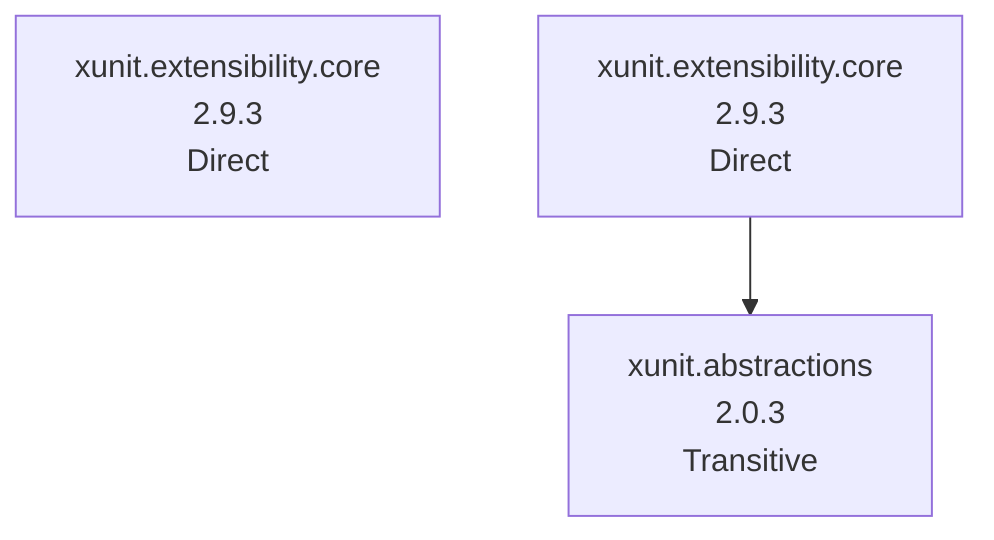

# NuGet Audit Report - RolandConverter

- Snapshot ID: `20260405031912_74cdf4ae`
- Captured UTC: `2026-04-05T03:19:12.5014714+00:00`
- Solution: `C:\Users\windo\OneDrive\Documents\Development\RolandConverter\RolandConverter\RolandConverter.csproj`
- Source identity key: `75A57C6E1FD1B537`
- Source identity kind: `disk-path`
- Source machine: `SURFACELAPTOP7`
- Repository root: `C:\Users\windo\OneDrive\Documents\Development\RolandConverter\RolandConverter`
- Git remote: `-`
- Analysis status: `Complete`
- Projects analysed: `1`
- Packages discovered: `3`
- Direct packages: `2`
- Transitive packages: `1`
- Dependency edges: `1`
- Error diagnostics: `0`
- Warning diagnostics: `3`
- Delta changed: `False`
- Knowledge snapshot generated: `2026-04-05T03:19:12.5014714+00:00`

## Attention Required

| Severity | Project | Package | Message | TFM |
|---|---|---|---|---|
| Warning | RolandConverter | xunit.abstractions | Package 'xunit.abstractions' 2.0.3: latest compatible stable matches the resolved version, but that release was published more than a year ago on nuget.org. | net8.0-windows7.0 |
| Warning | RolandConverter | xunit.extensibility.core | Package 'xunit.extensibility.core' 2.9.3: latest compatible stable matches the resolved version, but that release was published more than a year ago on nuget.org. | net8.0-windows |
| Warning | RolandConverter | xunit.extensibility.core | Package 'xunit.extensibility.core' 2.9.3: latest compatible stable matches the resolved version, but that release was published more than a year ago on nuget.org. | net8.0-windows7.0 |

## Change Summary

No previous accepted snapshot was available for comparison.

## Knowledge Changes

| Package | Version | Determined UTC | Previous Health | Current Health | Risk | Alert | Remediation | Summary |
|---|---|---|---|---|---|---|---|---|
| xunit.abstractions | 2.0.3 | 2026-04-05T03:19:12.5014714+00:00 | - | abandoned | 34.80 (Medium) | 49.80 (Medium) | Latest compatible stable release is more than a year old on nuget.org; evaluate maintenance and alternatives. | Attention is now required for this package version. |
| xunit.extensibility.core | 2.9.3 | 2026-04-05T03:19:12.5014714+00:00 | - | abandoned | 35.00 (Medium) | 44.00 (Medium) | Latest compatible stable release is more than a year old on nuget.org; evaluate maintenance and alternatives. | Attention is now required for this package version. |

## Security and Health Transitions

No package health transitions were detected relative to the previous accepted snapshot.

## Dependency Relationship Changes

No dependency edge changes were detected relative to the previous accepted snapshot.

## Project Details

### RolandConverter

- Path: `C:\Users\windo\OneDrive\Documents\Development\RolandConverter\RolandConverter\RolandConverter.csproj`
- Style: `PackageReference`
- Load state: `Loaded`
- Analysis status: `Complete`
- Target frameworks: `net8.0-windows`
- Diagnostics:
  - [Warning] Package 'xunit.abstractions' 2.0.3: latest compatible stable matches the resolved version, but that release was published more than a year ago on nuget.org.
  - [Warning] Package 'xunit.extensibility.core' 2.9.3: latest compatible stable matches the resolved version, but that release was published more than a year ago on nuget.org.
  - [Warning] Package 'xunit.extensibility.core' 2.9.3: latest compatible stable matches the resolved version, but that release was published more than a year ago on nuget.org.

| Package | Kind | Requested | Resolved | Health | Vulnerability Detail | Risk | Alert | Knowledge Determined | Status Changed | Remediation | Central | Parents | Path | TFM |
|---|---|---|---|---|---|---|---|---|---|---|---|---|---|---|
| xunit.abstractions | Transitive | - | 2.0.3 | abandoned | - | 34.80 (Medium) | 49.80 (Medium) | 2026-04-05T03:19:12.5014714+00:00 | 2026-04-05T03:19:12.5014714+00:00 | Latest compatible stable release is more than a year old on nuget.org; evaluate maintenance and alternatives. | No | xunit.extensibility.core | xunit.abstractions -> xunit.extensibility.core | net8.0-windows7.0 |
| xunit.extensibility.core | Direct | 2.9.3 | - | abandoned | - | 35.00 (Medium) | 44.00 (Medium) | 2026-04-05T03:19:12.5014714+00:00 | 2026-04-05T03:19:12.5014714+00:00 | Latest compatible stable release is more than a year old on nuget.org; evaluate maintenance and alternatives. | No | - | - | net8.0-windows |
| xunit.extensibility.core | Direct | - | 2.9.3 | abandoned | - | 35.00 (Medium) | 44.00 (Medium) | 2026-04-05T03:19:12.5014714+00:00 | 2026-04-05T03:19:12.5014714+00:00 | Latest compatible stable release is more than a year old on nuget.org; evaluate maintenance and alternatives. | No | - | xunit.extensibility.core | net8.0-windows7.0 |

#### Dependency Graph Table

| From Package | To Package | TFM |
|---|---|---|
| xunit.extensibility.core | xunit.abstractions | net8.0-windows7.0 |

#### Dependency Graph Mermaid

## Snapshot Warnings

- Attention required: 3 package diagnostics are warnings.
