# NuGet Audit Report - RolandConverter.Tests

- Snapshot ID: `20260405130131_a5825e42`
- Captured UTC: `2026-04-05T13:01:31.0682227+00:00`
- Solution: `C:\Users\windo\OneDrive\Documents\Development\RolandConverter\RolandConverter\RolandConverter.Tests\RolandConverter.Tests.csproj`
- Source identity key: `EC7827B12CAA2B2C`
- Source identity kind: `disk-path`
- Source machine: `SURFACELAPTOP7`
- Repository root: `C:\Users\windo\OneDrive\Documents\Development\RolandConverter\RolandConverter\RolandConverter.Tests`
- Git remote: `-`
- Analysis status: `Complete`
- Projects analysed: `1`
- Packages discovered: `15`
- Direct packages: `4`
- Transitive packages: `11`
- Dependency edges: `12`
- Error diagnostics: `0`
- Warning diagnostics: `14`
- Delta changed: `True`
- Knowledge snapshot generated: `2026-04-05T13:01:31.0682227+00:00`

## Attention Required

| Severity | Project | Package | Message | .NET version |
|---|---|---|---|---|
| Warning | RolandConverter.Tests | coverlet.collector | Package 'coverlet.collector' 6.0.2 is outdated. Latest compatible stable version: 6.0.4. | net9.0 |
| Warning | RolandConverter.Tests | Microsoft.CodeCoverage | Package 'Microsoft.CodeCoverage' 17.12.0 is outdated. Latest compatible stable version: 18.3.0. | net9.0 |
| Warning | RolandConverter.Tests | Microsoft.NET.Test.Sdk | Package 'Microsoft.NET.Test.Sdk' 17.12.0 is outdated. Latest compatible stable version: 18.3.0. | net9.0 |
| Warning | RolandConverter.Tests | Microsoft.TestPlatform.ObjectModel | Package 'Microsoft.TestPlatform.ObjectModel' 17.12.0 is outdated. Latest compatible stable version: 18.3.0. | net9.0 |
| Warning | RolandConverter.Tests | Microsoft.TestPlatform.TestHost | Package 'Microsoft.TestPlatform.TestHost' 17.12.0 is outdated. Latest compatible stable version: 18.3.0. | net9.0 |
| Warning | RolandConverter.Tests | Newtonsoft.Json | Package 'Newtonsoft.Json' 13.0.1 is outdated. Latest compatible stable version: 13.0.4. | net9.0 |
| Warning | RolandConverter.Tests | System.Reflection.Metadata | Package 'System.Reflection.Metadata' 1.6.0 is outdated. Latest compatible stable version: 10.0.5. | net9.0 |
| Warning | RolandConverter.Tests | xunit | Package 'xunit' 2.9.2 is outdated. Latest compatible stable version: 2.9.3. | net9.0 |
| Warning | RolandConverter.Tests | xunit.analyzers | Package 'xunit.analyzers' 1.16.0 is outdated. Latest compatible stable version: 1.27.0. | net9.0 |
| Warning | RolandConverter.Tests | xunit.assert | Package 'xunit.assert' 2.9.2 is outdated. Latest compatible stable version: 2.9.3. | net9.0 |
| Warning | RolandConverter.Tests | xunit.core | Package 'xunit.core' 2.9.2 is outdated. Latest compatible stable version: 2.9.3. | net9.0 |
| Warning | RolandConverter.Tests | xunit.extensibility.core | Package 'xunit.extensibility.core' 2.9.2 is outdated. Latest compatible stable version: 2.9.3. | net9.0 |
| Warning | RolandConverter.Tests | xunit.extensibility.execution | Package 'xunit.extensibility.execution' 2.9.2 is outdated. Latest compatible stable version: 2.9.3. | net9.0 |
| Warning | RolandConverter.Tests | xunit.runner.visualstudio | Package 'xunit.runner.visualstudio' 2.8.2 is outdated. Latest compatible stable version: 3.1.5. | net9.0 |

## Change Summary

| Project | Package | Change | Previous | Current | .NET version |
|---|---|---|---|---|---|
| RolandConverter.Tests | xunit.abstractions | MetadataChanged | 2.0.3 | 2.0.3 | net9.0 |

## Knowledge Changes

| Package | Version | Determined UTC | Previous Health | Current Health | Risk | Alert | Remediation | Summary |
|---|---|---|---|---|---|---|---|---|
| xunit.abstractions | 2.0.3 | 2026-04-05T13:01:31.0682227+00:00 | abandoned | ok | 24.90 (Low) | 31.80 (Medium) | - | Development status is now Active. Remediation guidance changed. |

## Security and Health Transitions

| Project | Package | Previous Health | Current Health | Previous Vulnerabilities | Current Vulnerabilities | .NET version |
|---|---|---|---|---|---|---|
| RolandConverter.Tests | xunit.abstractions | abandoned | ok | - | - | net9.0 |

## Dependency Relationship Changes

No dependency edge changes were detected relative to the previous accepted snapshot.

## Project Details

### RolandConverter.Tests

- Path: `C:\Users\windo\OneDrive\Documents\Development\RolandConverter\RolandConverter\RolandConverter.Tests\RolandConverter.Tests.csproj`
- Style: `PackageReference`
- Load state: `Loaded`
- Analysis status: `Complete`
- .NET version: `net9.0`
- Diagnostics:
  - [Warning] Package 'coverlet.collector' 6.0.2 is outdated. Latest compatible stable version: 6.0.4.
  - [Warning] Package 'Microsoft.CodeCoverage' 17.12.0 is outdated. Latest compatible stable version: 18.3.0.
  - [Warning] Package 'Microsoft.NET.Test.Sdk' 17.12.0 is outdated. Latest compatible stable version: 18.3.0.
  - [Warning] Package 'Microsoft.TestPlatform.ObjectModel' 17.12.0 is outdated. Latest compatible stable version: 18.3.0.
  - [Warning] Package 'Microsoft.TestPlatform.TestHost' 17.12.0 is outdated. Latest compatible stable version: 18.3.0.
  - [Warning] Package 'Newtonsoft.Json' 13.0.1 is outdated. Latest compatible stable version: 13.0.4.
  - [Warning] Package 'System.Reflection.Metadata' 1.6.0 is outdated. Latest compatible stable version: 10.0.5.
  - [Warning] Package 'xunit' 2.9.2 is outdated. Latest compatible stable version: 2.9.3.
  - [Warning] Package 'xunit.analyzers' 1.16.0 is outdated. Latest compatible stable version: 1.27.0.
  - [Warning] Package 'xunit.assert' 2.9.2 is outdated. Latest compatible stable version: 2.9.3.
  - [Warning] Package 'xunit.core' 2.9.2 is outdated. Latest compatible stable version: 2.9.3.
  - [Warning] Package 'xunit.extensibility.core' 2.9.2 is outdated. Latest compatible stable version: 2.9.3.
  - [Warning] Package 'xunit.extensibility.execution' 2.9.2 is outdated. Latest compatible stable version: 2.9.3.
  - [Warning] Package 'xunit.runner.visualstudio' 2.8.2 is outdated. Latest compatible stable version: 3.1.5.

| Package | Kind | Requested | Resolved | Health | Vulnerability Detail | Risk | Alert | Knowledge Determined | Status Changed | Remediation | Central | Parents | Path | .NET version |
|---|---|---|---|---|---|---|---|---|---|---|---|---|---|---|
| coverlet.collector | Direct | 6.0.2 | 6.0.2 | outdated->6.0.4 | - | 32.30 (Medium) | 43.40 (Medium) | 2026-04-05T13:01:31.0682227+00:00 | 2026-04-05T03:19:24.7313099+00:00 | Upgrade to 6.0.4. | No | - | coverlet.collector | net9.0 |
| Microsoft.CodeCoverage | Transitive | - | 17.12.0 | outdated->18.3.0 | - | 29.10 (Medium) | 40.20 (Medium) | 2026-04-05T13:01:31.0682227+00:00 | 2026-04-05T03:19:24.7313099+00:00 | Upgrade to 18.3.0. | No | Microsoft.NET.Test.Sdk | Microsoft.CodeCoverage -> Microsoft.NET.Test.Sdk | net9.0 |
| Microsoft.NET.Test.Sdk | Direct | 17.12.0 | 17.12.0 | outdated->18.3.0 | - | 32.30 (Medium) | 43.40 (Medium) | 2026-04-05T13:01:31.0682227+00:00 | 2026-04-05T03:19:24.7313099+00:00 | Upgrade to 18.3.0. | No | - | Microsoft.NET.Test.Sdk | net9.0 |
| Microsoft.TestPlatform.ObjectModel | Transitive | - | 17.12.0 | outdated->18.3.0 | - | 29.10 (Medium) | 40.20 (Medium) | 2026-04-05T13:01:31.0682227+00:00 | 2026-04-05T03:19:24.7313099+00:00 | Upgrade to 18.3.0. | No | Microsoft.TestPlatform.TestHost | Microsoft.TestPlatform.ObjectModel -> Microsoft.TestPlatform.TestHost -> Microsoft.NET.Test.Sdk | net9.0 |
| Microsoft.TestPlatform.TestHost | Transitive | - | 17.12.0 | outdated->18.3.0 | - | 29.10 (Medium) | 40.20 (Medium) | 2026-04-05T13:01:31.0682227+00:00 | 2026-04-05T03:19:24.7313099+00:00 | Upgrade to 18.3.0. | No | Microsoft.NET.Test.Sdk | Microsoft.TestPlatform.TestHost -> Microsoft.NET.Test.Sdk | net9.0 |
| Newtonsoft.Json | Transitive | - | 13.0.1 | outdated->13.0.4 | - | 29.10 (Medium) | 40.20 (Medium) | 2026-04-05T13:01:31.0682227+00:00 | 2026-04-05T03:19:24.7313099+00:00 | Upgrade to 13.0.4. | No | Microsoft.TestPlatform.TestHost | Newtonsoft.Json -> Microsoft.TestPlatform.TestHost -> Microsoft.NET.Test.Sdk | net9.0 |
| System.Reflection.Metadata | Transitive | - | 1.6.0 | outdated->10.0.5 | - | 29.10 (Medium) | 40.20 (Medium) | 2026-04-05T13:01:31.0682227+00:00 | 2026-04-05T03:19:24.7313099+00:00 | Upgrade to 10.0.5. | No | Microsoft.TestPlatform.ObjectModel | System.Reflection.Metadata -> Microsoft.TestPlatform.ObjectModel -> Microsoft.TestPlatform.TestHost -> Microsoft.NET.Test.Sdk | net9.0 |
| xunit | Direct | 2.9.2 | 2.9.2 | outdated->2.9.3 | - | 32.30 (Medium) | 43.40 (Medium) | 2026-04-05T13:01:31.0682227+00:00 | 2026-04-05T03:19:24.7313099+00:00 | Upgrade to 2.9.3. | No | - | xunit | net9.0 |
| xunit.abstractions | Transitive | - | 2.0.3 | ok | - | 24.90 (Low) | 31.80 (Medium) | 2026-04-05T13:01:31.0682227+00:00 | 2026-04-05T13:01:31.0682227+00:00 | - | No | xunit.extensibility.core | xunit.abstractions -> xunit.extensibility.core -> xunit.core -> xunit | net9.0 |
| xunit.analyzers | Transitive | - | 1.16.0 | outdated->1.27.0 | - | 29.10 (Medium) | 40.20 (Medium) | 2026-04-05T13:01:31.0682227+00:00 | 2026-04-05T03:19:24.7313099+00:00 | Upgrade to 1.27.0. | No | xunit | xunit.analyzers -> xunit | net9.0 |
| xunit.assert | Transitive | - | 2.9.2 | outdated->2.9.3 | - | 29.10 (Medium) | 40.20 (Medium) | 2026-04-05T13:01:31.0682227+00:00 | 2026-04-05T03:19:24.7313099+00:00 | Upgrade to 2.9.3. | No | xunit | xunit.assert -> xunit | net9.0 |
| xunit.core | Transitive | - | 2.9.2 | outdated->2.9.3 | - | 29.10 (Medium) | 40.20 (Medium) | 2026-04-05T13:01:31.0682227+00:00 | 2026-04-05T03:19:24.7313099+00:00 | Upgrade to 2.9.3. | No | xunit | xunit.core -> xunit | net9.0 |
| xunit.extensibility.core | Transitive | - | 2.9.2 | outdated->2.9.3 | - | 29.10 (Medium) | 40.20 (Medium) | 2026-04-05T13:01:31.0682227+00:00 | 2026-04-05T03:19:24.7313099+00:00 | Upgrade to 2.9.3. | No | xunit.core, xunit.extensibility.execution | xunit.extensibility.core -> xunit.core -> xunit | net9.0 |
| xunit.extensibility.execution | Transitive | - | 2.9.2 | outdated->2.9.3 | - | 29.10 (Medium) | 40.20 (Medium) | 2026-04-05T13:01:31.0682227+00:00 | 2026-04-05T03:19:24.7313099+00:00 | Upgrade to 2.9.3. | No | xunit.core | xunit.extensibility.execution -> xunit.core -> xunit | net9.0 |
| xunit.runner.visualstudio | Direct | 2.8.2 | 2.8.2 | outdated->3.1.5 | - | 32.30 (Medium) | 43.40 (Medium) | 2026-04-05T13:01:31.0682227+00:00 | 2026-04-05T03:19:24.7313099+00:00 | Upgrade to 3.1.5. | No | - | xunit.runner.visualstudio | net9.0 |

#### Dependency Graph Table

| From Package | To Package | .NET version |
|---|---|---|
| Microsoft.NET.Test.Sdk | Microsoft.CodeCoverage | net9.0 |
| Microsoft.NET.Test.Sdk | Microsoft.TestPlatform.TestHost | net9.0 |
| Microsoft.TestPlatform.ObjectModel | System.Reflection.Metadata | net9.0 |
| Microsoft.TestPlatform.TestHost | Microsoft.TestPlatform.ObjectModel | net9.0 |
| Microsoft.TestPlatform.TestHost | Newtonsoft.Json | net9.0 |
| xunit | xunit.analyzers | net9.0 |
| xunit | xunit.assert | net9.0 |
| xunit | xunit.core | net9.0 |
| xunit.core | xunit.extensibility.core | net9.0 |
| xunit.core | xunit.extensibility.execution | net9.0 |
| xunit.extensibility.core | xunit.abstractions | net9.0 |
| xunit.extensibility.execution | xunit.extensibility.core | net9.0 |

#### Dependency Graph Mermaid

```mermaid
graph TD
    NC__USERS_WINDO_ONEDRIVE_DOCUMENTS_DEVELOPMENT_ROLANDCONVERTER_ROLANDCONVERTER_ROLANDCONVERTER_TESTS_ROLANDCONVERTER_TESTS_CSPROJ_C__USERS_WINDO_ONEDRIVE_DOCUMENTS_DEVELOPMENT_ROLANDCONVERTER_ROLANDCONVERTER_ROLANDCONVERTER_TESTS_ROLANDCONVERTER_TESTS_CSPROJ_NET9_0_NONE_COVERLET_COLLECTOR["coverlet.collector\n6.0.2\nDirect"]
    NC__USERS_WINDO_ONEDRIVE_DOCUMENTS_DEVELOPMENT_ROLANDCONVERTER_ROLANDCONVERTER_ROLANDCONVERTER_TESTS_ROLANDCONVERTER_TESTS_CSPROJ_C__USERS_WINDO_ONEDRIVE_DOCUMENTS_DEVELOPMENT_ROLANDCONVERTER_ROLANDCONVERTER_ROLANDCONVERTER_TESTS_ROLANDCONVERTER_TESTS_CSPROJ_NET9_0_NONE_MICROSOFT_CODECOVERAGE["Microsoft.CodeCoverage\n17.12.0\nTransitive"]
    NC__USERS_WINDO_ONEDRIVE_DOCUMENTS_DEVELOPMENT_ROLANDCONVERTER_ROLANDCONVERTER_ROLANDCONVERTER_TESTS_ROLANDCONVERTER_TESTS_CSPROJ_C__USERS_WINDO_ONEDRIVE_DOCUMENTS_DEVELOPMENT_ROLANDCONVERTER_ROLANDCONVERTER_ROLANDCONVERTER_TESTS_ROLANDCONVERTER_TESTS_CSPROJ_NET9_0_NONE_MICROSOFT_NET_TEST_SDK["Microsoft.NET.Test.Sdk\n17.12.0\nDirect"]
    NC__USERS_WINDO_ONEDRIVE_DOCUMENTS_DEVELOPMENT_ROLANDCONVERTER_ROLANDCONVERTER_ROLANDCONVERTER_TESTS_ROLANDCONVERTER_TESTS_CSPROJ_C__USERS_WINDO_ONEDRIVE_DOCUMENTS_DEVELOPMENT_ROLANDCONVERTER_ROLANDCONVERTER_ROLANDCONVERTER_TESTS_ROLANDCONVERTER_TESTS_CSPROJ_NET9_0_NONE_MICROSOFT_TESTPLATFORM_OBJECTMODEL["Microsoft.TestPlatform.ObjectModel\n17.12.0\nTransitive"]
    NC__USERS_WINDO_ONEDRIVE_DOCUMENTS_DEVELOPMENT_ROLANDCONVERTER_ROLANDCONVERTER_ROLANDCONVERTER_TESTS_ROLANDCONVERTER_TESTS_CSPROJ_C__USERS_WINDO_ONEDRIVE_DOCUMENTS_DEVELOPMENT_ROLANDCONVERTER_ROLANDCONVERTER_ROLANDCONVERTER_TESTS_ROLANDCONVERTER_TESTS_CSPROJ_NET9_0_NONE_MICROSOFT_TESTPLATFORM_TESTHOST["Microsoft.TestPlatform.TestHost\n17.12.0\nTransitive"]
    NC__USERS_WINDO_ONEDRIVE_DOCUMENTS_DEVELOPMENT_ROLANDCONVERTER_ROLANDCONVERTER_ROLANDCONVERTER_TESTS_ROLANDCONVERTER_TESTS_CSPROJ_C__USERS_WINDO_ONEDRIVE_DOCUMENTS_DEVELOPMENT_ROLANDCONVERTER_ROLANDCONVERTER_ROLANDCONVERTER_TESTS_ROLANDCONVERTER_TESTS_CSPROJ_NET9_0_NONE_NEWTONSOFT_JSON["Newtonsoft.Json\n13.0.1\nTransitive"]
    NC__USERS_WINDO_ONEDRIVE_DOCUMENTS_DEVELOPMENT_ROLANDCONVERTER_ROLANDCONVERTER_ROLANDCONVERTER_TESTS_ROLANDCONVERTER_TESTS_CSPROJ_C__USERS_WINDO_ONEDRIVE_DOCUMENTS_DEVELOPMENT_ROLANDCONVERTER_ROLANDCONVERTER_ROLANDCONVERTER_TESTS_ROLANDCONVERTER_TESTS_CSPROJ_NET9_0_NONE_SYSTEM_REFLECTION_METADATA["System.Reflection.Metadata\n1.6.0\nTransitive"]
    NC__USERS_WINDO_ONEDRIVE_DOCUMENTS_DEVELOPMENT_ROLANDCONVERTER_ROLANDCONVERTER_ROLANDCONVERTER_TESTS_ROLANDCONVERTER_TESTS_CSPROJ_C__USERS_WINDO_ONEDRIVE_DOCUMENTS_DEVELOPMENT_ROLANDCONVERTER_ROLANDCONVERTER_ROLANDCONVERTER_TESTS_ROLANDCONVERTER_TESTS_CSPROJ_NET9_0_NONE_XUNIT["xunit\n2.9.2\nDirect"]
    NC__USERS_WINDO_ONEDRIVE_DOCUMENTS_DEVELOPMENT_ROLANDCONVERTER_ROLANDCONVERTER_ROLANDCONVERTER_TESTS_ROLANDCONVERTER_TESTS_CSPROJ_C__USERS_WINDO_ONEDRIVE_DOCUMENTS_DEVELOPMENT_ROLANDCONVERTER_ROLANDCONVERTER_ROLANDCONVERTER_TESTS_ROLANDCONVERTER_TESTS_CSPROJ_NET9_0_NONE_XUNIT_ABSTRACTIONS["xunit.abstractions\n2.0.3\nTransitive"]
    NC__USERS_WINDO_ONEDRIVE_DOCUMENTS_DEVELOPMENT_ROLANDCONVERTER_ROLANDCONVERTER_ROLANDCONVERTER_TESTS_ROLANDCONVERTER_TESTS_CSPROJ_C__USERS_WINDO_ONEDRIVE_DOCUMENTS_DEVELOPMENT_ROLANDCONVERTER_ROLANDCONVERTER_ROLANDCONVERTER_TESTS_ROLANDCONVERTER_TESTS_CSPROJ_NET9_0_NONE_XUNIT_ANALYZERS["xunit.analyzers\n1.16.0\nTransitive"]
    NC__USERS_WINDO_ONEDRIVE_DOCUMENTS_DEVELOPMENT_ROLANDCONVERTER_ROLANDCONVERTER_ROLANDCONVERTER_TESTS_ROLANDCONVERTER_TESTS_CSPROJ_C__USERS_WINDO_ONEDRIVE_DOCUMENTS_DEVELOPMENT_ROLANDCONVERTER_ROLANDCONVERTER_ROLANDCONVERTER_TESTS_ROLANDCONVERTER_TESTS_CSPROJ_NET9_0_NONE_XUNIT_ASSERT["xunit.assert\n2.9.2\nTransitive"]
    NC__USERS_WINDO_ONEDRIVE_DOCUMENTS_DEVELOPMENT_ROLANDCONVERTER_ROLANDCONVERTER_ROLANDCONVERTER_TESTS_ROLANDCONVERTER_TESTS_CSPROJ_C__USERS_WINDO_ONEDRIVE_DOCUMENTS_DEVELOPMENT_ROLANDCONVERTER_ROLANDCONVERTER_ROLANDCONVERTER_TESTS_ROLANDCONVERTER_TESTS_CSPROJ_NET9_0_NONE_XUNIT_CORE["xunit.core\n2.9.2\nTransitive"]
    NC__USERS_WINDO_ONEDRIVE_DOCUMENTS_DEVELOPMENT_ROLANDCONVERTER_ROLANDCONVERTER_ROLANDCONVERTER_TESTS_ROLANDCONVERTER_TESTS_CSPROJ_C__USERS_WINDO_ONEDRIVE_DOCUMENTS_DEVELOPMENT_ROLANDCONVERTER_ROLANDCONVERTER_ROLANDCONVERTER_TESTS_ROLANDCONVERTER_TESTS_CSPROJ_NET9_0_NONE_XUNIT_EXTENSIBILITY_CORE["xunit.extensibility.core\n2.9.2\nTransitive"]
    NC__USERS_WINDO_ONEDRIVE_DOCUMENTS_DEVELOPMENT_ROLANDCONVERTER_ROLANDCONVERTER_ROLANDCONVERTER_TESTS_ROLANDCONVERTER_TESTS_CSPROJ_C__USERS_WINDO_ONEDRIVE_DOCUMENTS_DEVELOPMENT_ROLANDCONVERTER_ROLANDCONVERTER_ROLANDCONVERTER_TESTS_ROLANDCONVERTER_TESTS_CSPROJ_NET9_0_NONE_XUNIT_EXTENSIBILITY_EXECUTION["xunit.extensibility.execution\n2.9.2\nTransitive"]
    NC__USERS_WINDO_ONEDRIVE_DOCUMENTS_DEVELOPMENT_ROLANDCONVERTER_ROLANDCONVERTER_ROLANDCONVERTER_TESTS_ROLANDCONVERTER_TESTS_CSPROJ_C__USERS_WINDO_ONEDRIVE_DOCUMENTS_DEVELOPMENT_ROLANDCONVERTER_ROLANDCONVERTER_ROLANDCONVERTER_TESTS_ROLANDCONVERTER_TESTS_CSPROJ_NET9_0_NONE_XUNIT_RUNNER_VISUALSTUDIO["xunit.runner.visualstudio\n2.8.2\nDirect"]
    NC__USERS_WINDO_ONEDRIVE_DOCUMENTS_DEVELOPMENT_ROLANDCONVERTER_ROLANDCONVERTER_ROLANDCONVERTER_TESTS_ROLANDCONVERTER_TESTS_CSPROJ_C__USERS_WINDO_ONEDRIVE_DOCUMENTS_DEVELOPMENT_ROLANDCONVERTER_ROLANDCONVERTER_ROLANDCONVERTER_TESTS_ROLANDCONVERTER_TESTS_CSPROJ_NET9_0_NONE_MICROSOFT_NET_TEST_SDK --> NC__USERS_WINDO_ONEDRIVE_DOCUMENTS_DEVELOPMENT_ROLANDCONVERTER_ROLANDCONVERTER_ROLANDCONVERTER_TESTS_ROLANDCONVERTER_TESTS_CSPROJ_C__USERS_WINDO_ONEDRIVE_DOCUMENTS_DEVELOPMENT_ROLANDCONVERTER_ROLANDCONVERTER_ROLANDCONVERTER_TESTS_ROLANDCONVERTER_TESTS_CSPROJ_NET9_0_NONE_MICROSOFT_CODECOVERAGE
    NC__USERS_WINDO_ONEDRIVE_DOCUMENTS_DEVELOPMENT_ROLANDCONVERTER_ROLANDCONVERTER_ROLANDCONVERTER_TESTS_ROLANDCONVERTER_TESTS_CSPROJ_C__USERS_WINDO_ONEDRIVE_DOCUMENTS_DEVELOPMENT_ROLANDCONVERTER_ROLANDCONVERTER_ROLANDCONVERTER_TESTS_ROLANDCONVERTER_TESTS_CSPROJ_NET9_0_NONE_MICROSOFT_NET_TEST_SDK --> NC__USERS_WINDO_ONEDRIVE_DOCUMENTS_DEVELOPMENT_ROLANDCONVERTER_ROLANDCONVERTER_ROLANDCONVERTER_TESTS_ROLANDCONVERTER_TESTS_CSPROJ_C__USERS_WINDO_ONEDRIVE_DOCUMENTS_DEVELOPMENT_ROLANDCONVERTER_ROLANDCONVERTER_ROLANDCONVERTER_TESTS_ROLANDCONVERTER_TESTS_CSPROJ_NET9_0_NONE_MICROSOFT_TESTPLATFORM_TESTHOST
    NC__USERS_WINDO_ONEDRIVE_DOCUMENTS_DEVELOPMENT_ROLANDCONVERTER_ROLANDCONVERTER_ROLANDCONVERTER_TESTS_ROLANDCONVERTER_TESTS_CSPROJ_C__USERS_WINDO_ONEDRIVE_DOCUMENTS_DEVELOPMENT_ROLANDCONVERTER_ROLANDCONVERTER_ROLANDCONVERTER_TESTS_ROLANDCONVERTER_TESTS_CSPROJ_NET9_0_NONE_MICROSOFT_TESTPLATFORM_OBJECTMODEL --> NC__USERS_WINDO_ONEDRIVE_DOCUMENTS_DEVELOPMENT_ROLANDCONVERTER_ROLANDCONVERTER_ROLANDCONVERTER_TESTS_ROLANDCONVERTER_TESTS_CSPROJ_C__USERS_WINDO_ONEDRIVE_DOCUMENTS_DEVELOPMENT_ROLANDCONVERTER_ROLANDCONVERTER_ROLANDCONVERTER_TESTS_ROLANDCONVERTER_TESTS_CSPROJ_NET9_0_NONE_SYSTEM_REFLECTION_METADATA
    NC__USERS_WINDO_ONEDRIVE_DOCUMENTS_DEVELOPMENT_ROLANDCONVERTER_ROLANDCONVERTER_ROLANDCONVERTER_TESTS_ROLANDCONVERTER_TESTS_CSPROJ_C__USERS_WINDO_ONEDRIVE_DOCUMENTS_DEVELOPMENT_ROLANDCONVERTER_ROLANDCONVERTER_ROLANDCONVERTER_TESTS_ROLANDCONVERTER_TESTS_CSPROJ_NET9_0_NONE_MICROSOFT_TESTPLATFORM_TESTHOST --> NC__USERS_WINDO_ONEDRIVE_DOCUMENTS_DEVELOPMENT_ROLANDCONVERTER_ROLANDCONVERTER_ROLANDCONVERTER_TESTS_ROLANDCONVERTER_TESTS_CSPROJ_C__USERS_WINDO_ONEDRIVE_DOCUMENTS_DEVELOPMENT_ROLANDCONVERTER_ROLANDCONVERTER_ROLANDCONVERTER_TESTS_ROLANDCONVERTER_TESTS_CSPROJ_NET9_0_NONE_MICROSOFT_TESTPLATFORM_OBJECTMODEL
    NC__USERS_WINDO_ONEDRIVE_DOCUMENTS_DEVELOPMENT_ROLANDCONVERTER_ROLANDCONVERTER_ROLANDCONVERTER_TESTS_ROLANDCONVERTER_TESTS_CSPROJ_C__USERS_WINDO_ONEDRIVE_DOCUMENTS_DEVELOPMENT_ROLANDCONVERTER_ROLANDCONVERTER_ROLANDCONVERTER_TESTS_ROLANDCONVERTER_TESTS_CSPROJ_NET9_0_NONE_MICROSOFT_TESTPLATFORM_TESTHOST --> NC__USERS_WINDO_ONEDRIVE_DOCUMENTS_DEVELOPMENT_ROLANDCONVERTER_ROLANDCONVERTER_ROLANDCONVERTER_TESTS_ROLANDCONVERTER_TESTS_CSPROJ_C__USERS_WINDO_ONEDRIVE_DOCUMENTS_DEVELOPMENT_ROLANDCONVERTER_ROLANDCONVERTER_ROLANDCONVERTER_TESTS_ROLANDCONVERTER_TESTS_CSPROJ_NET9_0_NONE_NEWTONSOFT_JSON
    NC__USERS_WINDO_ONEDRIVE_DOCUMENTS_DEVELOPMENT_ROLANDCONVERTER_ROLANDCONVERTER_ROLANDCONVERTER_TESTS_ROLANDCONVERTER_TESTS_CSPROJ_C__USERS_WINDO_ONEDRIVE_DOCUMENTS_DEVELOPMENT_ROLANDCONVERTER_ROLANDCONVERTER_ROLANDCONVERTER_TESTS_ROLANDCONVERTER_TESTS_CSPROJ_NET9_0_NONE_XUNIT --> NC__USERS_WINDO_ONEDRIVE_DOCUMENTS_DEVELOPMENT_ROLANDCONVERTER_ROLANDCONVERTER_ROLANDCONVERTER_TESTS_ROLANDCONVERTER_TESTS_CSPROJ_C__USERS_WINDO_ONEDRIVE_DOCUMENTS_DEVELOPMENT_ROLANDCONVERTER_ROLANDCONVERTER_ROLANDCONVERTER_TESTS_ROLANDCONVERTER_TESTS_CSPROJ_NET9_0_NONE_XUNIT_ANALYZERS
    NC__USERS_WINDO_ONEDRIVE_DOCUMENTS_DEVELOPMENT_ROLANDCONVERTER_ROLANDCONVERTER_ROLANDCONVERTER_TESTS_ROLANDCONVERTER_TESTS_CSPROJ_C__USERS_WINDO_ONEDRIVE_DOCUMENTS_DEVELOPMENT_ROLANDCONVERTER_ROLANDCONVERTER_ROLANDCONVERTER_TESTS_ROLANDCONVERTER_TESTS_CSPROJ_NET9_0_NONE_XUNIT --> NC__USERS_WINDO_ONEDRIVE_DOCUMENTS_DEVELOPMENT_ROLANDCONVERTER_ROLANDCONVERTER_ROLANDCONVERTER_TESTS_ROLANDCONVERTER_TESTS_CSPROJ_C__USERS_WINDO_ONEDRIVE_DOCUMENTS_DEVELOPMENT_ROLANDCONVERTER_ROLANDCONVERTER_ROLANDCONVERTER_TESTS_ROLANDCONVERTER_TESTS_CSPROJ_NET9_0_NONE_XUNIT_ASSERT
    NC__USERS_WINDO_ONEDRIVE_DOCUMENTS_DEVELOPMENT_ROLANDCONVERTER_ROLANDCONVERTER_ROLANDCONVERTER_TESTS_ROLANDCONVERTER_TESTS_CSPROJ_C__USERS_WINDO_ONEDRIVE_DOCUMENTS_DEVELOPMENT_ROLANDCONVERTER_ROLANDCONVERTER_ROLANDCONVERTER_TESTS_ROLANDCONVERTER_TESTS_CSPROJ_NET9_0_NONE_XUNIT --> NC__USERS_WINDO_ONEDRIVE_DOCUMENTS_DEVELOPMENT_ROLANDCONVERTER_ROLANDCONVERTER_ROLANDCONVERTER_TESTS_ROLANDCONVERTER_TESTS_CSPROJ_C__USERS_WINDO_ONEDRIVE_DOCUMENTS_DEVELOPMENT_ROLANDCONVERTER_ROLANDCONVERTER_ROLANDCONVERTER_TESTS_ROLANDCONVERTER_TESTS_CSPROJ_NET9_0_NONE_XUNIT_CORE
    NC__USERS_WINDO_ONEDRIVE_DOCUMENTS_DEVELOPMENT_ROLANDCONVERTER_ROLANDCONVERTER_ROLANDCONVERTER_TESTS_ROLANDCONVERTER_TESTS_CSPROJ_C__USERS_WINDO_ONEDRIVE_DOCUMENTS_DEVELOPMENT_ROLANDCONVERTER_ROLANDCONVERTER_ROLANDCONVERTER_TESTS_ROLANDCONVERTER_TESTS_CSPROJ_NET9_0_NONE_XUNIT_CORE --> NC__USERS_WINDO_ONEDRIVE_DOCUMENTS_DEVELOPMENT_ROLANDCONVERTER_ROLANDCONVERTER_ROLANDCONVERTER_TESTS_ROLANDCONVERTER_TESTS_CSPROJ_C__USERS_WINDO_ONEDRIVE_DOCUMENTS_DEVELOPMENT_ROLANDCONVERTER_ROLANDCONVERTER_ROLANDCONVERTER_TESTS_ROLANDCONVERTER_TESTS_CSPROJ_NET9_0_NONE_XUNIT_EXTENSIBILITY_CORE
    NC__USERS_WINDO_ONEDRIVE_DOCUMENTS_DEVELOPMENT_ROLANDCONVERTER_ROLANDCONVERTER_ROLANDCONVERTER_TESTS_ROLANDCONVERTER_TESTS_CSPROJ_C__USERS_WINDO_ONEDRIVE_DOCUMENTS_DEVELOPMENT_ROLANDCONVERTER_ROLANDCONVERTER_ROLANDCONVERTER_TESTS_ROLANDCONVERTER_TESTS_CSPROJ_NET9_0_NONE_XUNIT_CORE --> NC__USERS_WINDO_ONEDRIVE_DOCUMENTS_DEVELOPMENT_ROLANDCONVERTER_ROLANDCONVERTER_ROLANDCONVERTER_TESTS_ROLANDCONVERTER_TESTS_CSPROJ_C__USERS_WINDO_ONEDRIVE_DOCUMENTS_DEVELOPMENT_ROLANDCONVERTER_ROLANDCONVERTER_ROLANDCONVERTER_TESTS_ROLANDCONVERTER_TESTS_CSPROJ_NET9_0_NONE_XUNIT_EXTENSIBILITY_EXECUTION
    NC__USERS_WINDO_ONEDRIVE_DOCUMENTS_DEVELOPMENT_ROLANDCONVERTER_ROLANDCONVERTER_ROLANDCONVERTER_TESTS_ROLANDCONVERTER_TESTS_CSPROJ_C__USERS_WINDO_ONEDRIVE_DOCUMENTS_DEVELOPMENT_ROLANDCONVERTER_ROLANDCONVERTER_ROLANDCONVERTER_TESTS_ROLANDCONVERTER_TESTS_CSPROJ_NET9_0_NONE_XUNIT_EXTENSIBILITY_CORE --> NC__USERS_WINDO_ONEDRIVE_DOCUMENTS_DEVELOPMENT_ROLANDCONVERTER_ROLANDCONVERTER_ROLANDCONVERTER_TESTS_ROLANDCONVERTER_TESTS_CSPROJ_C__USERS_WINDO_ONEDRIVE_DOCUMENTS_DEVELOPMENT_ROLANDCONVERTER_ROLANDCONVERTER_ROLANDCONVERTER_TESTS_ROLANDCONVERTER_TESTS_CSPROJ_NET9_0_NONE_XUNIT_ABSTRACTIONS
    NC__USERS_WINDO_ONEDRIVE_DOCUMENTS_DEVELOPMENT_ROLANDCONVERTER_ROLANDCONVERTER_ROLANDCONVERTER_TESTS_ROLANDCONVERTER_TESTS_CSPROJ_C__USERS_WINDO_ONEDRIVE_DOCUMENTS_DEVELOPMENT_ROLANDCONVERTER_ROLANDCONVERTER_ROLANDCONVERTER_TESTS_ROLANDCONVERTER_TESTS_CSPROJ_NET9_0_NONE_XUNIT_EXTENSIBILITY_EXECUTION --> NC__USERS_WINDO_ONEDRIVE_DOCUMENTS_DEVELOPMENT_ROLANDCONVERTER_ROLANDCONVERTER_ROLANDCONVERTER_TESTS_ROLANDCONVERTER_TESTS_CSPROJ_C__USERS_WINDO_ONEDRIVE_DOCUMENTS_DEVELOPMENT_ROLANDCONVERTER_ROLANDCONVERTER_ROLANDCONVERTER_TESTS_ROLANDCONVERTER_TESTS_CSPROJ_NET9_0_NONE_XUNIT_EXTENSIBILITY_CORE
```

## Snapshot Warnings

- One or more NuGet package project URL reachability checks failed (network, timeout, or TLS). Abandoned-package inference may be less accurate.
- Attention required: 14 package diagnostics are warnings.
